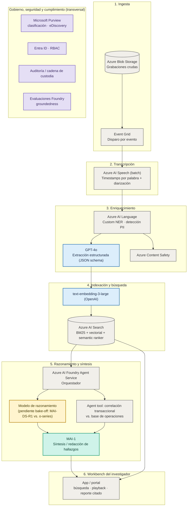
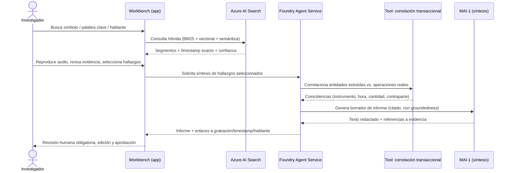

# AMV — Vigilancia de Mercado con Azure AI Foundry
### Arquitectura de referencia y diagrama lógico de la aplicación

> Basado en *"Caso 1 - AMV_Vigilancia_Mercado_AI_Foundry.docx"* (v1.0, 16-sep-2026).
> Principio de diseño: **arquitectura agnóstica al modelo**. Cada endpoint de Foundry
> puede intercambiarse sin rediseñar la plataforma. Para este prototipo, el modelo
> **MAI (MAI-1)** se usa **únicamente** en el componente **Síntesis / redacción de
> hallazgos**; el resto de componentes usa el servicio recomendado en la matriz de
> decisión del documento (Azure AI Speech, embeddings OpenAI, GPT-4o), dejando el
> razonamiento profundo pendiente de bake-off.

---

## 1. Arquitectura de referencia en Azure

### Mapeo de modelo/servicio por componente

| Capa | Componente | Servicio / modelo | Estado |
|---|---|---|---|
| Ingesta | Almacenamiento y disparo | Azure Blob Storage + Event Grid | Infraestructura |
| Transcripción | Speech-to-text, diarización | **Azure AI Speech** (batch) | Recomendado (maduro) |
| Enriquecimiento | Entidades / PII | Azure AI Language (Custom NER) | Recomendado |
| Enriquecimiento | Extracción estructurada (instrumento, contraparte, cantidad, valor) | **GPT-4o** (JSON schema) | Recomendado |
| Búsqueda | Embeddings semánticos | **text-embedding-3-large** (OpenAI) | Recomendado |
| Búsqueda | Índice híbrido | Azure AI Search (BM25 + vector + semantic ranker) | Infraestructura |
| Razonamiento | Detección de colusión / insider trading | MAI-DS-R1 *vs.* o-series | **Pendiente bake-off** |
| Correlación | Cruce con base de operaciones | Agent tools/functions | Infraestructura |
| **Síntesis / redacción de hallazgos** | Borrador de informe con citas | **MAI-1** | **Fijado para este prototipo** |
| Gobierno | Seguridad, trazabilidad, cumplimiento | Content Safety, Purview, Entra ID, evaluaciones Foundry | Transversal |

---

## 2. Diagrama lógico de la aplicación (flujo de una investigación)

Puntos clave del flujo lógico:

- **Human-in-the-loop no negociable**: MAI-1 solo *redacta*; el investigador aprueba.
- **Citación obligatoria**: cada afirmación del borrador enlaza a grabación + timestamp + hablante.
- **Confidence scoring por campo**: valores bajo umbral se marcan para revisión manual.
- **Cadena de custodia**: cada acción (búsqueda, reproducción, generación, aprobación) queda auditada.

---

## 3. Por qué MAI-1 solo en Síntesis / redacción de hallazgos

Según la matriz de decisión del documento original, este es el único componente donde
la recomendación es **"indistinto"** entre MAI y OpenAI (elegir por costo/latencia). Es
el punto de menor riesgo probatorio para introducir un modelo de Microsoft:

- No participa en la extracción estructurada (ese dato ya quedó fijado y citado antes de llegar a MAI).
- No decide sobre colusión/insider trading (eso es razonamiento, pendiente de bake-off).
- Su salida siempre pasa por revisión humana antes de convertirse en evidencia.
- Reduce el "blast radius" de adoptar un modelo más nuevo mientras se recopila evidencia
  de desempeño para ampliarlo a otros componentes.

---

## 4. Prototipo de demostración

Ver [index.html](index.html): mockup interactivo (datos simulados, sin backend) que
representa el workbench del investigador — búsqueda híbrida, detalle de segmento con
extracción estructurada y correlación transaccional, y el panel de **Síntesis con MAI-1**
con citas y revisión humana. Incluye una leyenda visual de qué modelo/servicio impulsa
cada componente, para reforzar la conversación de arquitectura con el cliente.

## 5. Próximos pasos (del documento original)

1. Confirmar disponibilidad de modelos MAI y OpenAI en el tenant/región de AMV.
2. Construir un conjunto dorado anotado con grabaciones representativas.
3. Ejecutar bake-off (transcripción, extracción, razonamiento) con evaluaciones de Foundry.
4. Extender esta PoC a un end-to-end con datos reales de AMV.
5. Definir modelo de gobierno y cadena de custodia con áreas legal y de cumplimiento.
