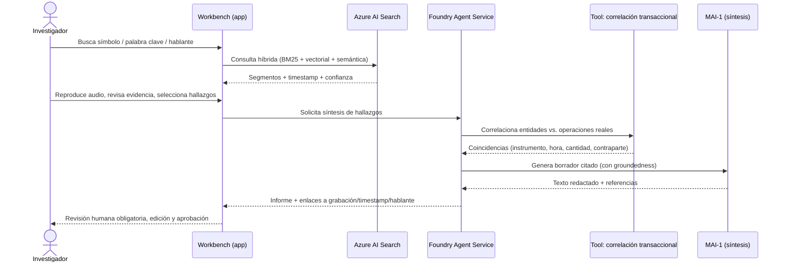

# AMV — Vigilancia de Mercado · Lógica y funcionamiento del prototipo

> Documento funcional del prototipo interactivo [index.html](index.html).
> Complementa a [ARQUITECTURA.md](ARQUITECTURA.md), que describe la arquitectura de
> referencia en Azure. Aquí se explica **qué hace la app**, **cómo está construida** y
> **qué representa cada parte** frente a la solución real.

---

## 1. Propósito del prototipo

Es un **mockup interactivo de una sola página** (HTML + CSS + JavaScript, sin backend)
que simula el *workbench del investigador* de AMV para vigilancia de mercado. Sirve para
conversar con el cliente sobre la experiencia y la arquitectura sin necesidad de desplegar
infraestructura: todos los datos son **ficticios** y viven en el navegador.

Lo que demuestra:

- Búsqueda sobre conversaciones transcritas (símbolo, palabra clave, hablante).
- Detalle de un segmento con reproducción simulada, transcripción y **extracción
  estructurada con confianza por campo**.
- **Correlación** de lo dicho contra una base de operaciones.
- **Síntesis / redacción de hallazgos con MAI-1**, con citas y revisión humana obligatoria.
- **Cadena de custodia** (registro de auditoría) de cada acción del investigador.
- La **arquitectura de referencia** y los **artefactos de Azure** necesarios por capa.

---

## 2. Estructura de la interfaz

```
┌───────────────────────────────────────────────────────────────┐
│ Barra superior (marca AMV + etiqueta "Prototipo")             │
├───────────────────────────────────────────────────────────────┤
│ Leyenda de modelos (qué servicio impulsa cada componente)     │
├──────────────┬────────────────────────────────────────────────┤
│  Sidebar     │  Panel principal (pestañas):                   │
│  - Buscador  │   1. Resultados de búsqueda                    │
│  - Filtros   │   2. Detalle de segmento                       │
│  - Expedien- │   3. Síntesis de hallazgos (MAI)               │
│    tes       │   4. Gestionar datos (CRUD)                    │
│              │   5. Arquitectura (diagramas + artefactos)     │
│              ├────────────────────────────────────────────────┤
│              │  Cadena de custodia (log de auditoría)         │
└──────────────┴────────────────────────────────────────────────┘
```

### Pestañas

| Pestaña | Qué muestra | Servicio/modelo que representa |
|---|---|---|
| **Resultados de búsqueda** | Segmentos que coinciden con la consulta y los filtros | Azure AI Search (BM25 + vectorial + semántico) |
| **Detalle de segmento** | Reproductor simulado, transcripción resaltada, campos extraídos con % de confianza y resultado de correlación | Azure AI Speech + GPT-4o + Agent tool de correlación |
| **Síntesis de hallazgos (MAI)** | Borrador de informe citado, groundedness y checklist de aprobación | Foundry Agent Service + MAI-1 |
| **Gestionar datos (CRUD)** | Alta/edición/borrado de expedientes y segmentos (datos de la demo) | Solo prototipo (localStorage) |
| **Arquitectura** | Diagrama de referencia, flujo lógico y tabla de artefactos de Azure | Documentación embebida |

---

## 3. Modelo de datos (en memoria / localStorage)

El prototipo maneja dos colecciones que se guardan en `localStorage` del navegador
(claves `amv_demo_cases_v1` y `amv_demo_segments_v1`). No hay servidor ni base de datos.

### Expediente (`case`)
```js
{ id: "INV-2026-014", desc: "Posible colusión · símbolo ACSA", active: true }
```

### Segmento de conversación (`segment`)
```js
{
  id: 1,
  recording: "REC-0091",          // grabación de origen
  speaker: "C. Mendoza",          // hablante (diarización)
  symbol: "ACSA",                 // instrumento mencionado
  date: "14/09/2026", time: "09:32:07",
  confidence: 92,                 // confianza global de transcripción (%)
  text: "…transcripción…",
  highlight: "ACSA",              // término a resaltar
  entities: {                     // extracción estructurada, con confianza por campo
    instrumento:  { v: "ACSA", c: 95 },
    contraparte:  { v: "Fondo Delta S.A.", c: 88 },
    cantidad:     { v: "120.000 acciones", c: 74 },
    valor:        { v: "$ 1.842 / acción", c: 69 }
  },
  transactionMatch: true          // ¿coincide con la base de operaciones?
}
```

> En la solución real, estos objetos serían el resultado del pipeline de Azure
> (Speech → Language/GPT-4o → índice de Azure AI Search), no datos escritos a mano.

---

## 4. Flujo lógico de una investigación



Cómo se refleja cada paso en el prototipo:

1. **Búsqueda** → función `runSearch()`: filtra los segmentos por texto, hablante y banda
   de confianza; resalta coincidencias con `highlightText()`.
2. **Detalle y evidencia** → `openSegment(id)`: pinta el reproductor simulado, la
   transcripción y la ficha de extracción con `conf-pill` de color según la confianza,
   más el cuadro de **correlación** (verde si `transactionMatch`, rojo si no).
3. **Síntesis** → `generateSynthesis()`: simula la orquestación (spinner + `setTimeout`)
   y produce un informe con **citas** (`cite()`) que enlazan de vuelta al segmento de
   evidencia, un valor de *groundedness* y un checkbox de aprobación.
4. **Aprobación humana** → `onReviewToggle()`: el informe no es evidencia hasta que el
   investigador lo marca como revisado.
5. **Auditoría** → `logCustody()`: cada acción (búsqueda, apertura, generación, edición,
   exportación, aprobación) se registra con hora en la cadena de custodia.

---

## 5. Principios de diseño representados

- **Human-in-the-loop no negociable**: MAI-1 solo *redacta*; el investigador aprueba.
- **Citación obligatoria**: cada afirmación del borrador enlaza a grabación + timestamp +
  hablante (los enlaces "Ver evidencia N" reabren el segmento correspondiente).
- **Confidence scoring por campo**: los valores bajo umbral se marcan (colores) para
  revisión manual; la síntesis lo advierte explícitamente.
- **Cadena de custodia**: trazabilidad de cada acción, base para valor probatorio.
- **Arquitectura agnóstica al modelo**: la leyenda y la pestaña de Arquitectura muestran
  qué servicio impulsa cada componente; solo la **síntesis** y el **razonamiento** usan
  MAI en este prototipo, y cualquier endpoint es intercambiable.

---

## 6. Mapa de funciones (JavaScript)

| Área | Funciones clave |
|---|---|
| Persistencia | `loadData()`, `saveData()`, `resetDemoData()` |
| Inicialización | `init()`, `renderAll()` |
| Expedientes | `renderCases()`, `selectCase()`, `renderCaseTable()`, `showCaseForm()`, `saveCaseForm()`, `deleteCase()` |
| Búsqueda | `runSearch()`, `confBand()`, `highlightText()`, `renderResults()` |
| Detalle | `openSegment()` |
| Síntesis | `generateSynthesis()`, `cite()`, `toggleEdit()`, `exportReport()`, `onReviewToggle()` |
| Segmentos (CRUD) | `renderSegmentTable()`, `showSegmentForm()`, `saveSegmentForm()`, `entityField()`, `deleteSegment()` |
| Navegación | `switchTab()`, `renderArchDiagrams()` (Mermaid) |
| Auditoría | `logCustody()` |
| Seguridad | `escapeHtml()` en todo dato dinámico para evitar inyección de HTML/XSS |

---

## 7. Qué es simulado vs. qué sería real

| Elemento en la app | En el prototipo | En la solución real de Azure |
|---|---|---|
| Grabaciones y reproductor | Onda y barra decorativas | Audio en Azure Blob Storage |
| Transcripción y hablantes | Texto fijo (seed) | Azure AI Speech (batch, diarización, timestamps) |
| Extracción de entidades | Valores escritos en el seed | Azure AI Language + GPT-4o (JSON schema) |
| Búsqueda | Filtro `includes()` en memoria | Azure AI Search (BM25 + vector + semantic ranker) |
| Correlación transaccional | Bandera `transactionMatch` | Agent tool/function vs. base de operaciones |
| Síntesis con MAI | `setTimeout` + texto predefinido | Foundry Agent Service invocando MAI-1 |
| Groundedness | Valor fijo (91%) | Evaluaciones de Foundry |
| Persistencia | `localStorage` del navegador | Almacenamiento gobernado + Purview + Entra ID |

---

## 8. Cómo ejecutarlo

Es un archivo estático; basta abrir [index.html](index.html) en un navegador moderno
(Edge/Chrome). Los diagramas de la pestaña **Arquitectura** se renderizan con Mermaid
cargado desde CDN, por lo que esa pestaña requiere conexión a internet la primera vez que
se abre. El resto de la app funciona **sin conexión**.

> Nota: los datos se guardan por navegador. El botón **"Restaurar datos de ejemplo"** de la
> pestaña *Gestionar datos* limpia `localStorage` y vuelve a los valores de fábrica.
